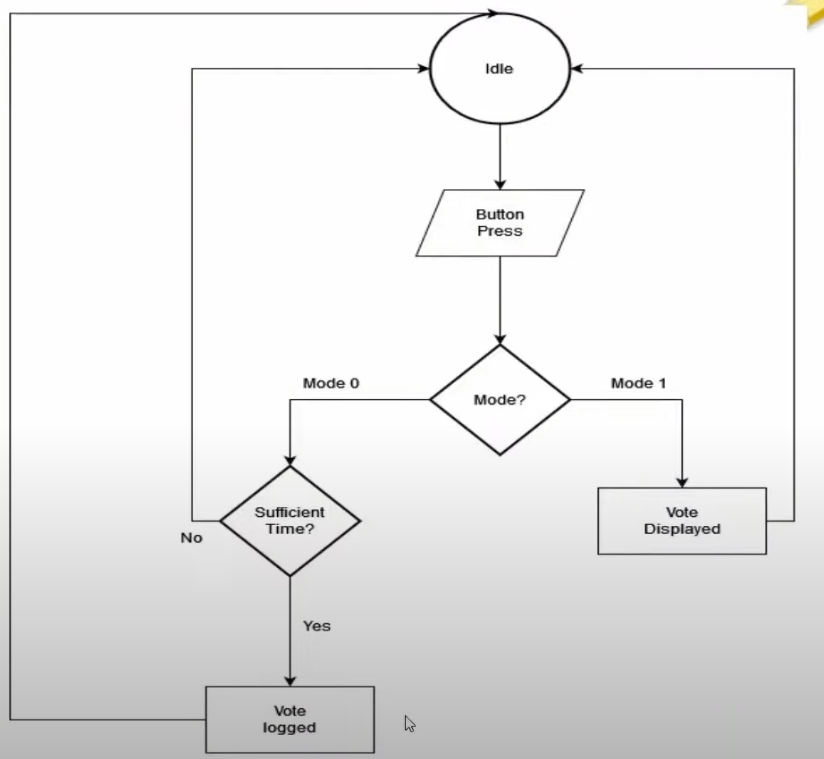

# 🗳️ Electronic Voting Machine (EVM) using Verilog

## 📌 Project Overview
This project implements a **digital Electronic Voting Machine (EVM)** using **Verilog HDL**.  
The design uses **Finite State Machine (FSM)** principles to ensure **secure voting, vote logging, and result display**.  
It was simulated and tested using **Vivado / ModelSim**.

---

## 🔹 Features
- Supports **multiple candidates** with individual vote counters.  
- Implements **secure button press detection** with debouncing logic.  
- **Mode-based operation**:
  - **Mode 0** → Voting mode (logs votes).  
  - **Mode 1** → Result mode (displays votes).  
- Prevents **double voting** during a single session.  
- Tested using a **SystemVerilog testbench**.  

---

## 🔹 Flowchart
The design is based on the following FSM flow:



*(Add your saved flowchart image as `flowchart.png` in the repo so it renders here)*

---

## 🔹 Basic Code Snippet
Here’s a simple **button control logic** module (part of the project):

```verilog
module buttonControl(
    input clock,
    input reset,
    input button,
    output reg valid_vote
);

reg [30:0] counter;

always @(posedge clock) begin
    if (reset)
        counter <= 0;
    else begin
        if (button && counter < 11)
            counter <= counter + 1;
        else if (!button)
            counter <= 0;
    end
end

always @(posedge clock) begin
    if (reset)
        valid_vote <= 1'b0;
    else begin
        if (counter == 10)
            valid_vote <= 1'b1;
        else
            valid_vote <= 1'b0;
    end
end

endmodule
